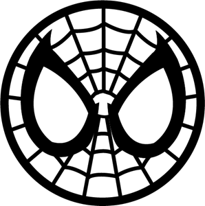
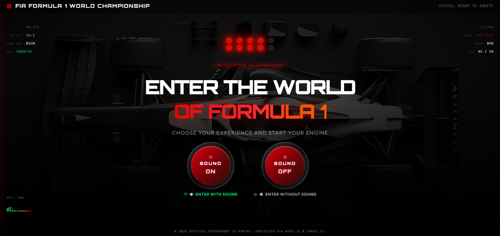
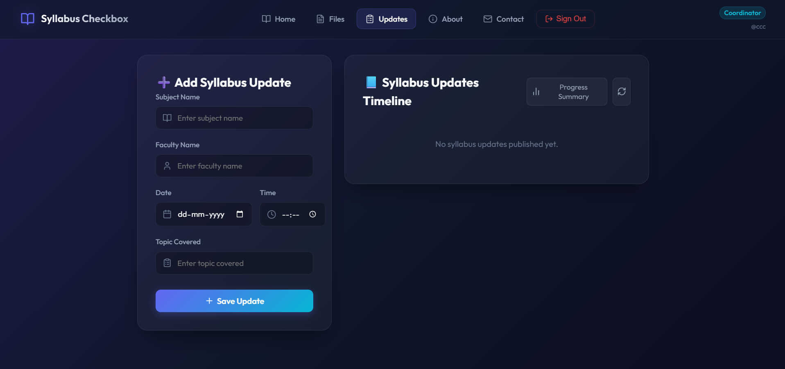

# 🏎️ Rajveer Zala | 3D Interactive Portfolio

<div align="center">
  
  <h3>Full-Stack Developer & Interactive UI Engineer</h3>
  <p>Crafting high-performance systems, immersive 3D web experiences, and scalable full-stack applications.</p>
</div>

<p align="center">
  
  
  
  
  
</p>

---

## ✨ Features & Highlights

### 📺 Cinematic Scroll-Driven Background
- **Preloaded Video Scrubbing**: Blends preloaded high-fidelity video frames (`frames` and `frames-mobile`) onto a `<canvas>` element, smoothly scrubbed via scroll triggers.
- **GSAP Scroll-Triggered Panels**: Text panels overlay the video background and dynamically fade in/out at specific scroll positions to guide the narrative:
  - **Hero Title**: Dynamically responsive viewport font scaling (`text-[6.2vw]`) preventing clipping on mobile screens (iPhone SE).
  - **About Me**: Interactive card showcasing my background.
  - **My Mindset**: Highlighting continuous growth, consistency, and discipline.
  - **Beyond Technology**: Strategic focus and future aspirations.

### 🏛️ Education & Experience Timeline
- **Silver Oak University**: B.Tech in Computer Engineering details, highlighting a CGPA of **8.33** in a glowing layout.
- **Lemtoj Infotech Jr. React Developer Internship**: Details of full-stack React.js feature creation, API integration, and collaborative workflow.
- **Interactive Certificate Lightbox**: Pop-up preview for the internship certificate with spring-loaded overlay animations.

### 💼 Project Showcase Section (Interactive Carousel)
- **Continuous Marquee Slider**: A custom CSS infinite loop animation of project screenshot cards.
- **Play/Pause on Hover**: Hovering over the slider freezes the slide animation seamlessly.
- **Glassmorphic Detail Overlay**: Click on any project card to reveal a modal built with **React Portals** and **Framer Motion AnimatePresence**, displaying:
  - Responsive layout banner.
  - Dynamic Tech stack badges.
  - Comprehensive feature list.
  - Clickable live demo & source code links.
  - Lenis scroll prevention and custom scrollbars for smooth content navigation.

### ⚙️ Interactive Bento Grid
- **Dynamic Marquee Skills Card**: Interactive double-scrolling marquee showing a curated stack of icons (React, Next.js, Node.js, MongoDB, Supabase, Tailwind, etc.) using high-res Devicon SVGs.
- **Custom Music Player Card**: Styled visualizer player card loaded with **OneRepublic's "I Ain't Worried"** track.
- **Looped Video Card**: Loop rendering F1 racing footage preconfigured to a comfortable default volume (15%) for optimal user experience.
- **Direct Formspree contact input**: Simple, AJAX-powered note submission form that sends messages directly to `rajveersinhzala954@gmail.com` with a loader spinner and `message send !` confirmation triggers.

---

## 🛠️ Tech Stack & Libraries
- **Core Framework**: React 19, Vite 8
- **Styles & Layout**: Tailwind CSS v4, Glassmorphism
- **Animations**: GSAP (GreenSock), Framer Motion 12, Custom CSS Transitions
- **Scroll Physics**: Lenis (Smooth Scroll)
- **Icons**: Lucide React, Devicon SVGs
- **Form Forwarder**: Formspree (custom form ID `xeewzrza`)

---

## 📸 Portfolio Preview

<div align="center">
  <h4>Interactive Bento Grid Layout</h4>
  
  
  <h4>Syllabus Tracker Project Detail Modal</h4>
  
</div>

---

## 🚀 Getting Started

### Prerequisites
Make sure you have Node.js installed on your machine.

### Installation
1. Clone the repository:
   ```bash
   git clone https://github.com/rajveerzala67/RajveerX.git
   ```
2. Navigate to the project directory:
   ```bash
   cd RajveerX
   ```
3. Install dependencies:
   ```bash
   npm install
   ```

### Development Server
Run the local dev server:
```bash
npm run dev
```

### Production Build
Compile production assets:
```bash
npm run build
```

---

<div align="center">
  <p>Created with ❤️ by <a href="https://github.com/rajveerzala67">Rajveer Zala</a></p>
</div>
